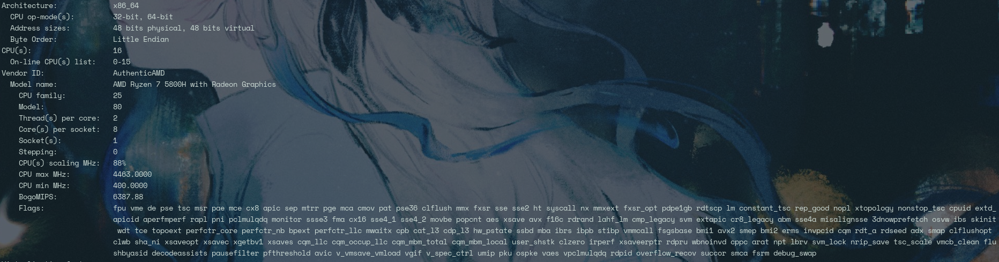

# 概述
- 该目录下博客用于记录学习CMU 15-418 parallel programing时的课程笔记和各Assignment的实现历程。主要是关于Assignment的记录。

## 目录
- [Assignment_01](https://anthosq.github.io/posts/cmu15418/cmu15418_a1)
- [Lesson_01 to 06]()
- [Assignment_02]()
- [Lesson_07_to_11]()
- [Assignment_03]()
- [Lesson_12_to_14]()
- [Assignment_04]()

## 我的电脑环境
- x86_64 laptop
- 8核 4.0 GHz AMD-R7 5800H 
- dynamic frequency from 400 MHz to 4463 MHz  
 